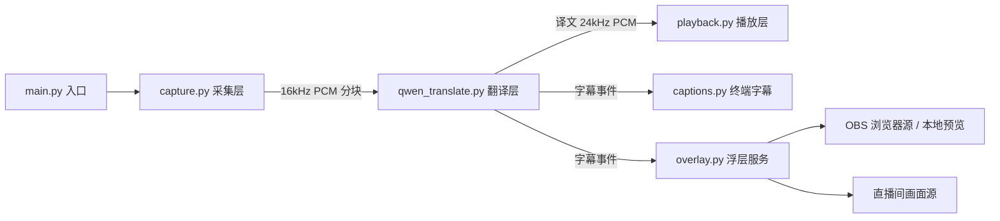
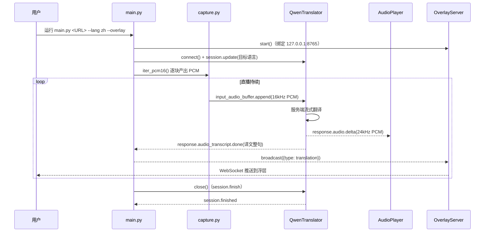

# 架构说明

## 1. 总览

项目采用**分层 + 异步流水线**设计：采集、翻译、输出、服务四层相互独立，通过回调/队列解耦。

## 2. 模块职责

| 模块 | 职责 | 关键接口 |
|---|---|---|
| `main.py` | CLI 参数、环境配置、会话编排与断线重连 | `amain()` / `run_pipeline()` / `run_mock()` |
| `capture.py` | yt-dlp 解析直播流、ffmpeg 转码采集 | `resolve_stream_url()` / `resolve_video_url()` / `iter_pcm16()` |
| `qwen_translate.py` | 百炼 Qwen3.5-LiveTranslate WebSocket 客户端 | `QwenTranslator.connect/send_audio/receive_loop/close` |
| `playback.py` | 后台线程播放译文 + WAV 落盘 | `AudioPlayer.start/write/close` |
| `captions.py` | 终端字幕（整句完成显示）与事件广播 | `CaptionPrinter` |
| `overlay.py` | 本地 HTTP+WebSocket 服务：字幕浮层、画面源、媒体代理 | `OverlayServer.start/broadcast/get_video_url` |
| `stats.py` | 延迟统计（首字/结束/整句，p50/p95） | `LatencyStats` |
| `tools/check_connection.py` | 连通性诊断 | CLI |

## 3. 运行时数据流

## 4. 翻译协议（Qwen3.5-LiveTranslate）

官方文档：[实时语音/音视频翻译-千问](https://help.aliyun.com/zh/model-studio/qwen3-5-livetranslate-flash-realtime)

### 连接与鉴权

- 端点：`wss://{WorkspaceId}.cn-beijing.maas.aliyuncs.com/api-ws/v1/realtime?model=qwen3.5-livetranslate-flash-realtime`
- 鉴权：`Authorization: Bearer <DASHSCOPE_API_KEY>`
- 业务空间域名不可用时（`IllegalEndpoint`），自动回退公共域名 `wss://dashscope.aliyuncs.com/api-ws/v1/realtime?model=...`

### 客户端事件

| 事件 | 用途 |
|---|---|
| `session.update` | 配置目标语言、输出模态、音色、热词、声音复刻、VAD 等 |
| `input_audio_buffer.append` | 推送 16kHz 单声道 PCM（base64） |
| `input_audio_buffer.commit` | Manual 模式下提交一段语音（本项目用 VAD 模式，无需手动提交） |
| `session.finish` | 结束会话前必须发送，等待 `session.finished` |

### 服务端事件（本项目用到）

| 事件 | 含义 |
|---|---|
| `session.created` / `session.updated` | 会话建立/配置确认 |
| `input_audio_buffer.speech_started/stopped` | VAD 检测到语音起止 |
| `response.audio.delta` | 译文音频增量（24kHz PCM base64） |
| `response.audio_transcript.text` | 译文文本增量（含待确认的预测文本） |
| `response.audio_transcript.done` | 译文整句完成 |
| `conversation.item.input_audio_transcription.completed` | 源语言原文整句识别完成 |
| `response.done` | 一轮响应完成 |
| `session.finished` | 服务端确认会话结束 |
| `error` | 服务端错误（如 60 秒无响应流超时） |

### VAD 与断句

- 默认服务端 VAD：静音 1000ms 判定一句结束，可通过 `--vad-silence-ms` 调小（300~500 适合快语速主播）
- 流式翻译在语音进行中就开始输出，不需要等整句说完

### 断线重连

- 服务端约 60 秒无响应流时会主动断开（`Response stream timeout`），属正常机制
- `run_pipeline` 捕获异常后按指数退避（1s → 30s）重建翻译会话
- **播放器线程只启动一次**，重连不会重启它，避免 `threads can only be started once`

## 5. 音频链路

- 输入：ffmpeg 统一转成 **16kHz 单声道 s16le**（百炼实时翻译输入规格），按 0.2s（6400 字节）分块
- 输出：服务端返回 **24kHz 单声道 PCM**，由 `AudioPlayer` 后台线程写入声卡（或保存 WAV）
- 音量/设备：`--volume`、`--device`；OBS 场景可指向 VB-Audio CABLE Input 实现译音混流

## 6. 浮层服务（overlay.py）

单端口同时提供 HTTP 页面与 WebSocket 推送：

| 路由 | 说明 |
|---|---|
| `/` | 字幕浮层页面（支持 `size/show_source/position/ttl` 参数） |
| `/ws` | 字幕推送 WebSocket（`{type: source|translation, text}`） |
| `/video` | 直播间画面播放页 |
| `/api/video_info` | 播放方案：YouTube/Twitch 返回官方嵌入，其它返回 HLS 代理地址 |
| `/api/video_url` | 解析后的直链（代理形式） |
| `/media` | HLS 媒体代理（清单同源改写 + 分片转发） |
| `/hls.min.js` | 本地 hls.js（离线可用） |

### 画面源播放策略

- YouTube/Twitch：**官方嵌入播放器**（iframe），最稳定，绕开 CDN 对非浏览器客户端的拦截
- 其它平台：hls.js + 本地媒体代理（部分 CDN 会拦截，直链方案更可靠）

### 为什么直链优先

YouTube 等 CDN 会对非浏览器客户端做指纹拦截（curl/Python 直连分片会 403），因此：

1. `--obs-video` 优先输出**直链**，交给 OBS 的 VLC/ffmpeg/浏览器自己去拉流
2. 本地播放页作为浏览器源兜底

## 7. 统计指标（stats.py）

| 指标 | 定义 | 说明 |
|---|---|---|
| 首字延迟 | `speech_started` → 第一个 `response.audio.delta` | 核心体验指标，实测约 0.5s |
| 结束延迟 | `speech_stopped` → 该段响应完成 | 需要句间有停顿 |
| 整句延迟 | `speech_started` → 该段响应完成 | 连续长句时的兜底 |

统计**不含直播平台自身缓冲**（YouTube/Twitch 一般还有 2~5 秒）。

## 8. 关键设计决策

- **单模型 S2S vs Pipeline**：单模型延迟低、端到端保留语气；代价是音色由模型固定。若需自定义音色可替换为 ASR+LLM+TTS 组合（见 development.md）
- **会话粒度**：一个会话对应一个目标语言，多语言输出需开多个会话
- **输出完整句优先**：终端默认只显示完成的整句，流式预览用 `--show-preview`，避免刷屏
- **本地优先**：浮层服务只绑 127.0.0.1，密钥只在本地 `.env`
